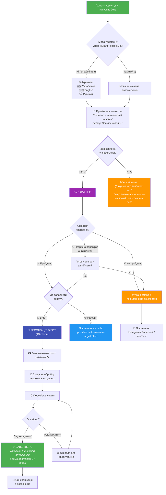
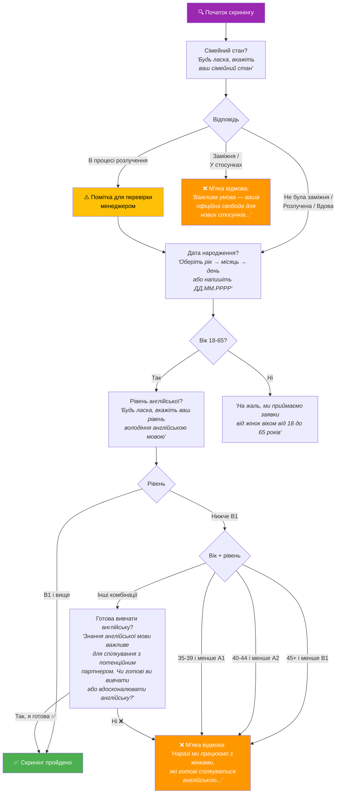
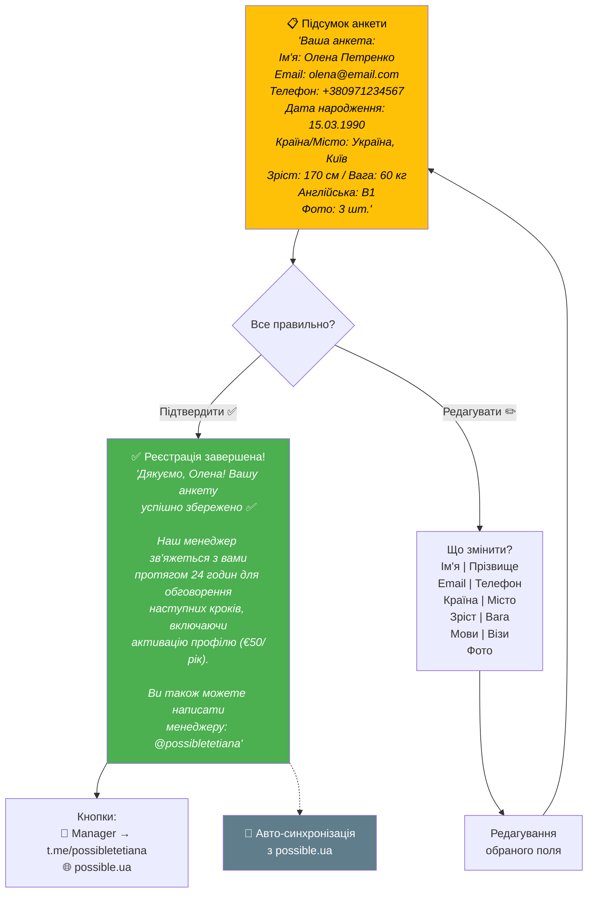
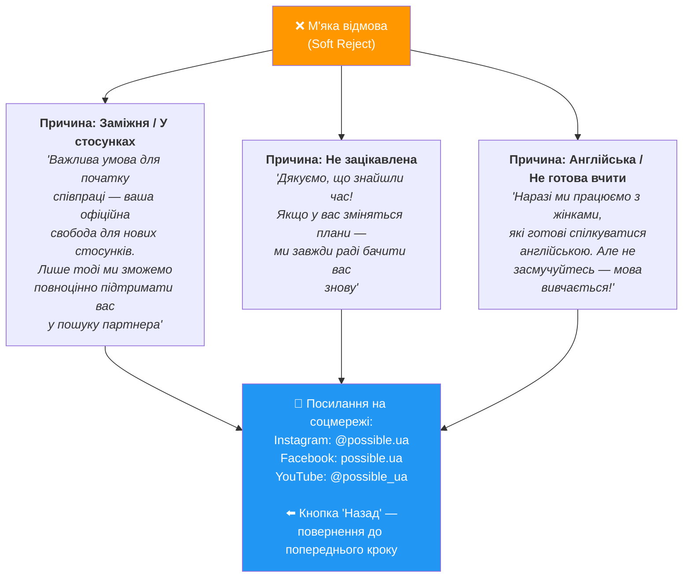
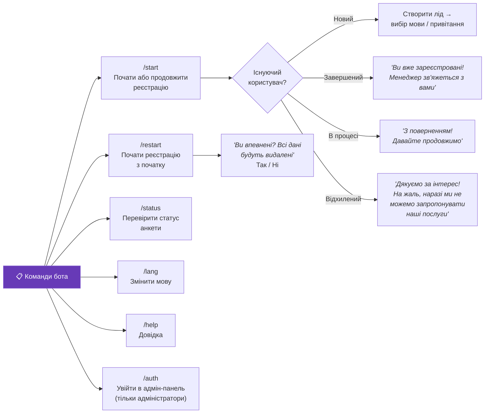
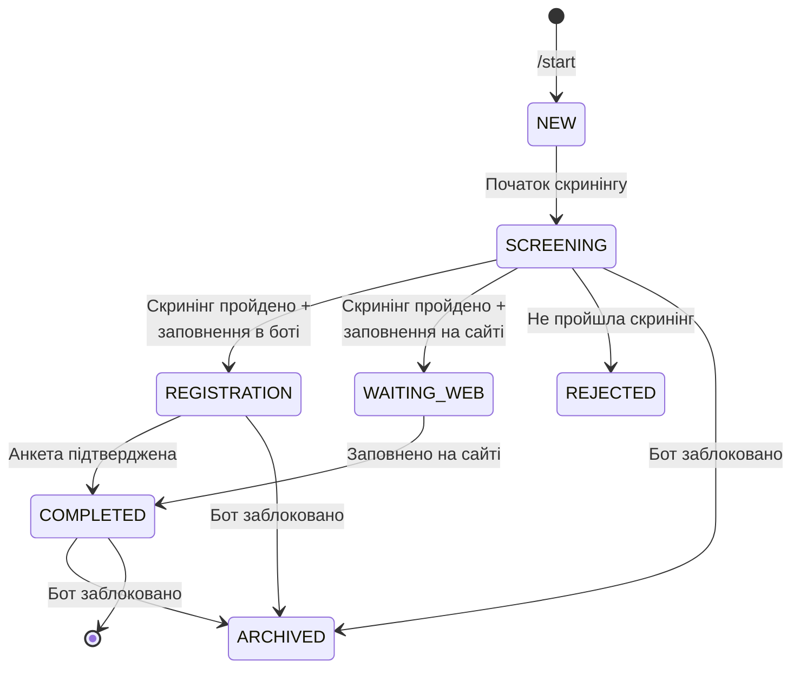
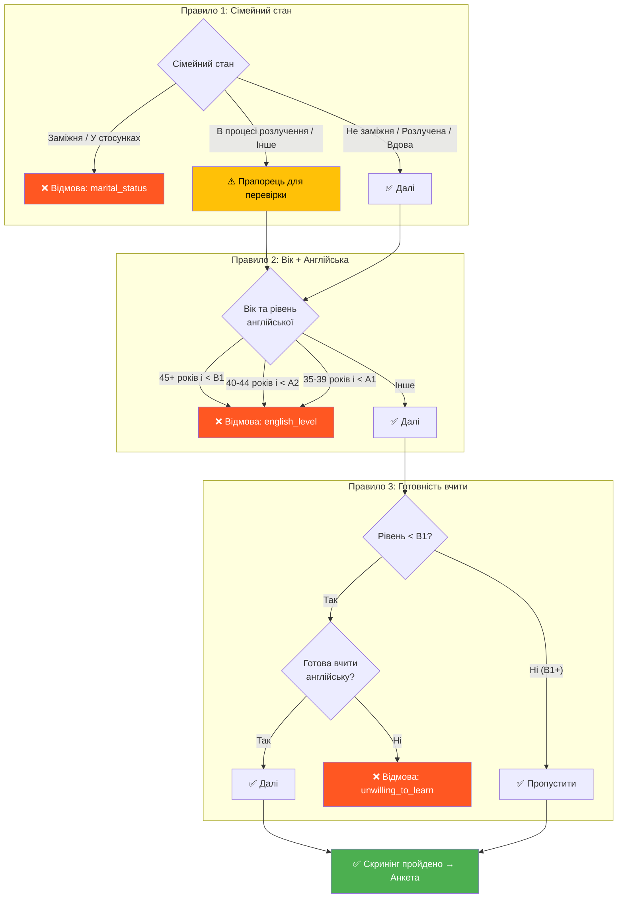

# Telegram Bot — Workflow Diagrams

Діаграми роботи Telegram-бота міжнародного шлюбного агентства Наталі Коваль (Possible.ua).

---

## 1. Загальний потік (Main Flow)

---

## 2. Скринінг (Screening Flow)

---

## 3. Реєстрація в боті (Registration Flow)

```mermaid
flowchart TD
    START_REG["📝 Початок реєстрації"] --> NAME["1. Ім'я<br/><i>'Як вас звати?<br/>Напишіть ваше ім'я'</i>"]

    NAME --> SURNAME["2. Прізвище<br/><i>'{Ім'я}, будь ласка,<br/>вкажіть ваше прізвище'</i>"]

    SURNAME --> EMAIL["3. Email<br/><i>'{Ім'я}, будь ласка, вкажіть<br/>вашу електронну адресу'</i>"]

    EMAIL --> PHONE["4. Телефон<br/>📱 Кнопка 'Надіслати номер'<br/>або введення вручну<br/><i>'+380971234567'</i>"]

    PHONE --> COUNTRY["5. Країна проживання<br/>🇺🇦 Україна / 🇵🇱 Польща<br/>🇩🇪 Німеччина / 🇨🇿 Чехія / Інша"]

    COUNTRY --> CITY["6. Місто<br/><i>'{Ім'я}, в якому місті<br/>ви живете?'</i>"]

    CITY --> HEIGHT["7. Зріст (см)<br/><i>'Будь ласка, вкажіть<br/>ваш зріст (см)'</i><br/>140-210 см"]

    HEIGHT --> WEIGHT["8. Вага (кг)<br/><i>'Будь ласка, вкажіть<br/>вашу вагу (кг)'</i><br/>40-150 кг"]

    WEIGHT --> LANGUAGES["9. Мови<br/><i>'Якими мовами ви розмовляєте?<br/>Оберіть усі, що підходять'</i><br/>Мультивибір + 'Готово'"]

    LANGUAGES --> VISAS["10. Візи<br/><i>'Візи яких країн у вас є?'</i><br/>Мультивибір + 'Готово'"]

    VISAS --> SOURCE["11. Джерело<br/><i>'Як ви дізналися<br/>про агентство Possible?'</i>"]

    SOURCE --> PROMO["12. Промокод<br/><i>'Чи є у вас промокод?'</i><br/>Так / Немає промокоду"]

    PROMO --> |"Є промокод"| PROMO_INPUT["Введіть промокод"] --> PHOTOS_STEP
    PROMO --> |"Немає"| PHOTOS_STEP

    PHOTOS_STEP["13. Фото<br/><i>'Надішліть кілька фотографій<br/>(мінімум 2). Бажано портрет<br/>та фото в повний зріст'</i><br/>PNG/JPG, до 5 МБ"]

    PHOTOS_STEP --> CONSENT_STEP["14. Згода<br/><i>'Я погоджуюся на обробку<br/>персональних даних'</i><br/><i>'Я погоджуюся з правилами<br/>сервісу Matchmaking boutique'</i>"]

    CONSENT_STEP --> |"Погоджуюся"| SUMMARY_STEP["📋 Підсумок анкети"]
    CONSENT_STEP --> |"Не погоджуюся"| CONSENT_BLOCKED["<i>'Без згоди на обробку даних<br/>ми не можемо завершити<br/>реєстрацію'</i>"]

    style START_REG fill:#3F51B5,color:#fff
    style SUMMARY_STEP fill:#4CAF50,color:#fff
    style CONSENT_BLOCKED fill:#FF5722,color:#fff
```

---

## 4. Підсумок і завершення (Summary & Completion)

---

## 5. М'яка відмова (Soft Reject Scenarios)

---

## 6. Команди бота (Bot Commands)

---

## 7. Статуси ліда (Lead Status Lifecycle)

---

## 8. Правила скринінгу (Screening Rules — Detail)

---

## 9. Навігація «Назад» (Back Navigation)

```mermaid
flowchart RL
    CONSENT["Згода"] --> PHOTOS["Фото"]
    PHOTOS --> PROMO["Промокод"]
    PROMO --> SOURCE["Джерело"]
    SOURCE --> VISAS["Візи"]
    VISAS --> LANGUAGES["Мови"]
    LANGUAGES --> WEIGHT["Вага"]
    WEIGHT --> HEIGHT["Зріст"]
    HEIGHT --> CITY["Місто"]
    CITY --> COUNTRY["Країна"]
    COUNTRY --> PHONE["Телефон"]
    PHONE --> EMAIL["Email"]
    EMAIL --> SURNAME["Прізвище"]
    SURNAME --> NAME["Ім'я"]
    NAME --> FILL_CHOICE["Вибір способу"]
    FILL_CHOICE --> ENGLISH["Англійська"]
    ENGLISH --> AGE["Дата народження"]
    AGE --> MARITAL["Сімейний стан"]
    MARITAL --> WELCOME["Привітання"]

    SOFT_REJECT["М'яка відмова"] -.-> |"marital_status"| MARITAL
    SOFT_REJECT -.-> |"not_interested"| WELCOME
    SOFT_REJECT -.-> |"unwilling_to_learn"| WILLING["Готовність вчити"]
    SOFT_REJECT -.-> |"english_level"| ENGLISH

    style SOFT_REJECT fill:#FF9800,color:#fff
```

---

## 10. Мови інтерфейсу (i18n)

Бот підтримує 3 мови з автоматичним визначенням:

| Мова | Код | Автовизначення | Вибір вручну |
|------|-----|---------------|-------------|
| Українська | `ua` | Так (якщо телефон `uk`) | 🇺🇦 Українська |
| English | `en` | Ні (завжди вибір) | 🇺🇸 English |
| Русский | `ru` | Так (якщо телефон `ru`) | 🏳️ Русский |

Мову можна змінити в будь-який момент командою `/lang`.
